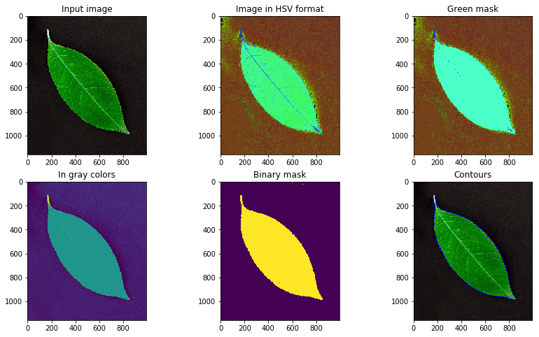

# CV-learning
## Courses

### [Python for Data Science and Machine Learning Bootcamp](https://www.udemy.com/course/python-for-data-science-and-machine-learning-bootcamp/)

**Skills:**
- Python
- NumPy
- Pandas
- Matplotlib, seaborn and plotly
- SciKit Learn

### [Intro to Deep Learning with PyTorch by Facebook](https://www.udacity.com/course/deep-learning-pytorch--ud188)

**Skills:**
- Intro to Deep Learning with PyTorch
- Introduction to PyTorch
- Deep Learning with PyTorch
- Convolutional Neural Networks
- Style Transfer
- Recurrent Neural Networks
- Natural Language Classification
- Deploying with PyTorch

### [Data Analysis for Software Engineers in the Higher School Of Economics](https://github.com/shestakoff/hse_se_ml)

**Skills:**
- Python
- Metric based methods
- Decision Trees
- Dimension Reduction
- Logistic Regression

## Projects
### [Color segmentation](https://github.com/tema7707/CV-learning/tree/master/color_segmentation) 

